# Transfer Learning X-Ray Classification for Pneumonia Detection

## Exploratory Data Analysis
From the notebook [transfer-learning-x-ray-eda](./notebooks/transfer-learning-x-ray-eda.ipynb)

### Training, Validation, and Test Set Counts

Comparison of training, validation, and test set counts shows that **~89%** of the images are in the **training set**. While only **0.27%** of the images are in **validation**, and **~11%** are in the **test set**.
For a dataset of 5856 images, which is quite small for image classification, the percent of images in the training, validation, and test set should be closer to **60%-20%-20%**.

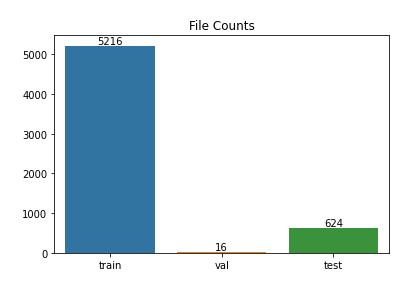

- **Step 1: Randomly redistribute the images to 60:20:20**

### Class Distribution Among Sets

Comparison of the distribution of Pneumonia and Normal images between the training, validation, and test set shows that there is a significant imbalance between the groups.

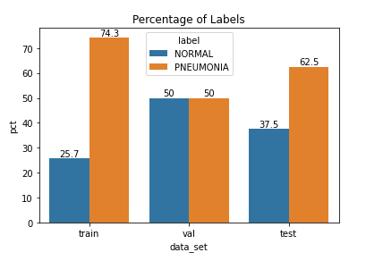

The biggest issue is that the **validation set is not the same distribution as the test set**, which means that a model that performs well on the validation set may not do well on the test set.
Through the random redistribution of images in Step1, the image class distribution should be very similar between training, validation, and test sets after that step.
While the **class imbalance of Pneumonia to Normal is significant**, it can be accounted for by **applying weights to the training** to penalize the model more for wrong of the less-represented class (Normal).
This should mitigate the class imbalance issue, since it is not a severe imbalance.

- **Step 2: Apply weights to the classes for training** 

### Pixel Intensities Between Pneumonia and Normal

It becomes clear from the pixel intensities below that there can be a **significant difference based on how bright the X-ray is**. Since these are from real X-rays, it can be assumed that **the model will have to perform well on dark and bright X-rays**. The best scenario is to make sure the distribution of images is very well shuffled and distributed proportionally across all sets of the groups.

- **Make sure the redistribution of images is random to have a mix of pixel intensities in each set**

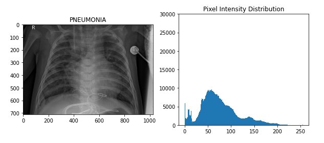
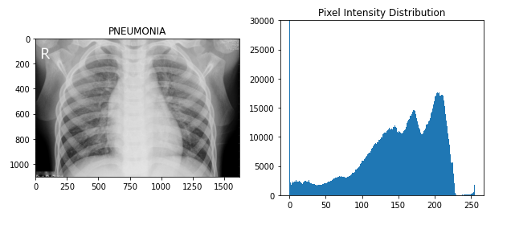
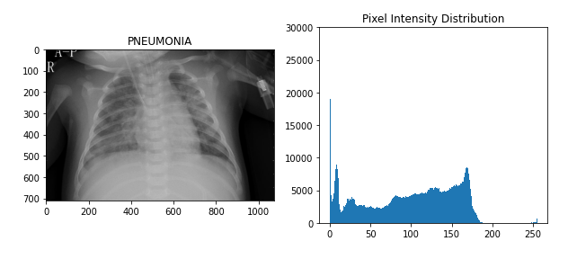
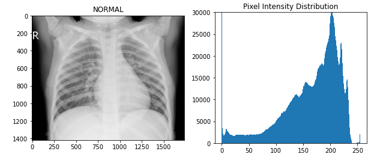
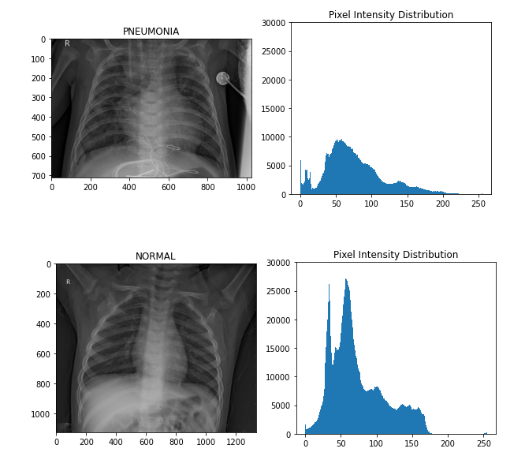
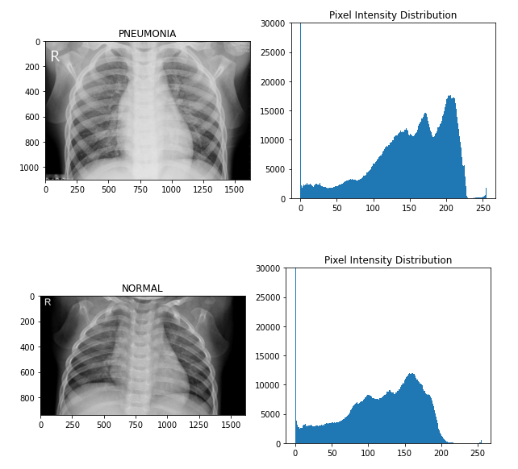

## Choosing a Transfer Model

Compare base models of VGG-16, InceptionV3, ResNet50, and DenseNet201 for performance. Use the best performing model for fine tuning.

### Pre-Processing

The X-ray image files were combined and randomly split into the into the train, val, and test sets at a 60:20:20 ratio.

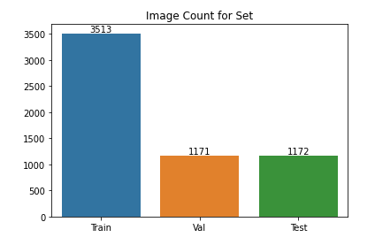

After randomly splitting the images, the distribution of Pneumonia and Normal was extremely similar between all sets of images.

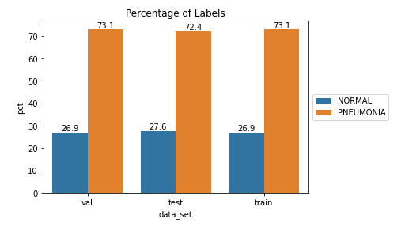

Based on the distribution imbalance, weights were applied to have the underrepresented class (Normal) have more of a penalty for wrong predictions.

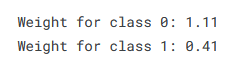

### Comparing Base Models

For the following models (VGG-16, InceptionV3, ResNet-50, DenseNet-201): 

Transfer learning models did not include the final dense layer and the pre-trained layers were frozen. A **2D Global Averaging layer** followed by a **30% Dropout layer** followed by a **Dense layer** with one node of **sigmoid activation** were added to do binary classification of the features created by the pre-trained model.

Chosen hyperparameter values listed below, all others were defaults.
- **Optimzer:** Adam
- **Loss Function:** Binary Crossentropy
- **Batch Size:** 512
- **Epochs:** 50
- **Early Stopping:** 10 patience

The **best performance** for this base model comparison was from **DenseNet-201** with an **F1 Score of 0.96** for the holdout test set

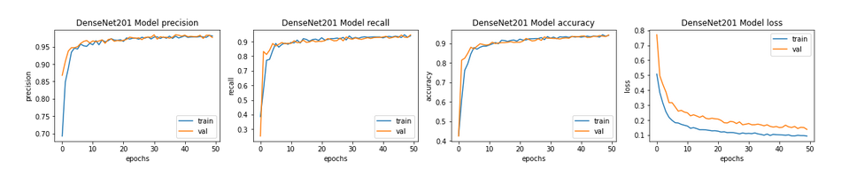
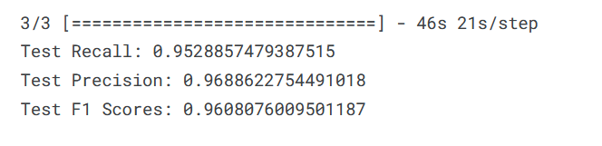

Below are the test results for the other base models:

#### VGG-16

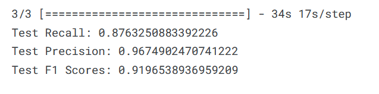

#### InceptionV3

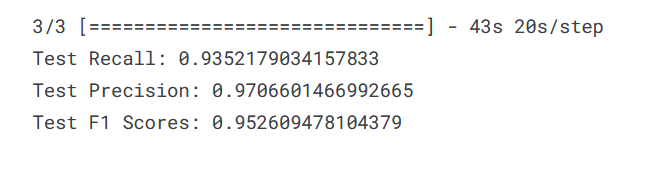

#### ResNet-50

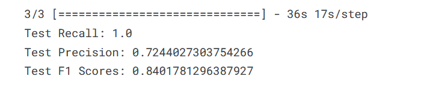

## HyperParameter Tuning of DenseNet-201

- **Step 1:** Tune Learning Rate
- **Step 2:** Tune Hidden Units and Batch Size
- **Step 3:** Tune Number of Layers
- **Step 4:** Tune Learning Rate Decay
- **Step 5:** Tune Momentum
- **Step 6:** Final random search around best performing hyperparameters

### Learning Rate
Tested 10 randomly selected learning rates between 1.0 and 0.0001. The trend of performance was best in the range of 0.09 to 0.05 for the learning rate.
The **best validation accuracy was 0.9639** from **learning rate 0.06103**

### Hidden Units and Batch Size
A grid search of both number of hidden units and the batch size was does together.
- A single Dense layer with the hidden units followed by a Batch Normalization layer followed by a Dropout of 30% was added between the pre-trained model and the output layer.
- 5 hidden unit values were tried **[4096, 2048, 1024, 512, 256]** for the single Dense layer
- 3 batch sizes of **[32, 64, 128]** * 8 TPU replicas

### Number of Hidden Layers
- Test out hidden layers by adding one layer at a time with **each new layer containing half the number of nodes**, with Batch Norm and Dropout at 30%.
- Test out hidden layers by **starting with two Dense layers of 4096 nodes** and adding one layer at time each with **half the number of nodes as the previous layer**.

### Learning Rate Decay
- 8 learning rate decay values randomly selected
    - The formula for the decay is learning_rate * 0.1 ** (epoch / s) and the **s value** was randomly selected **between 10 and 80**.
 
### Momentum Values
- 8 momentum values between 0.7 and 0.99
 
## Best Results From Hyperparameter Tuning
- **Learning Rate:** 0.06103
- **Hidden Units:** 4096
- **Batch Size:** 32 * 8 TPUs
- **Learning Rate Decay:** s value of 34
- **Momentum:** 0.84

**Resulting in Validation Accuracy of 0.9746**
 
 ### Fine Tune Based on Individual Results
 
 
